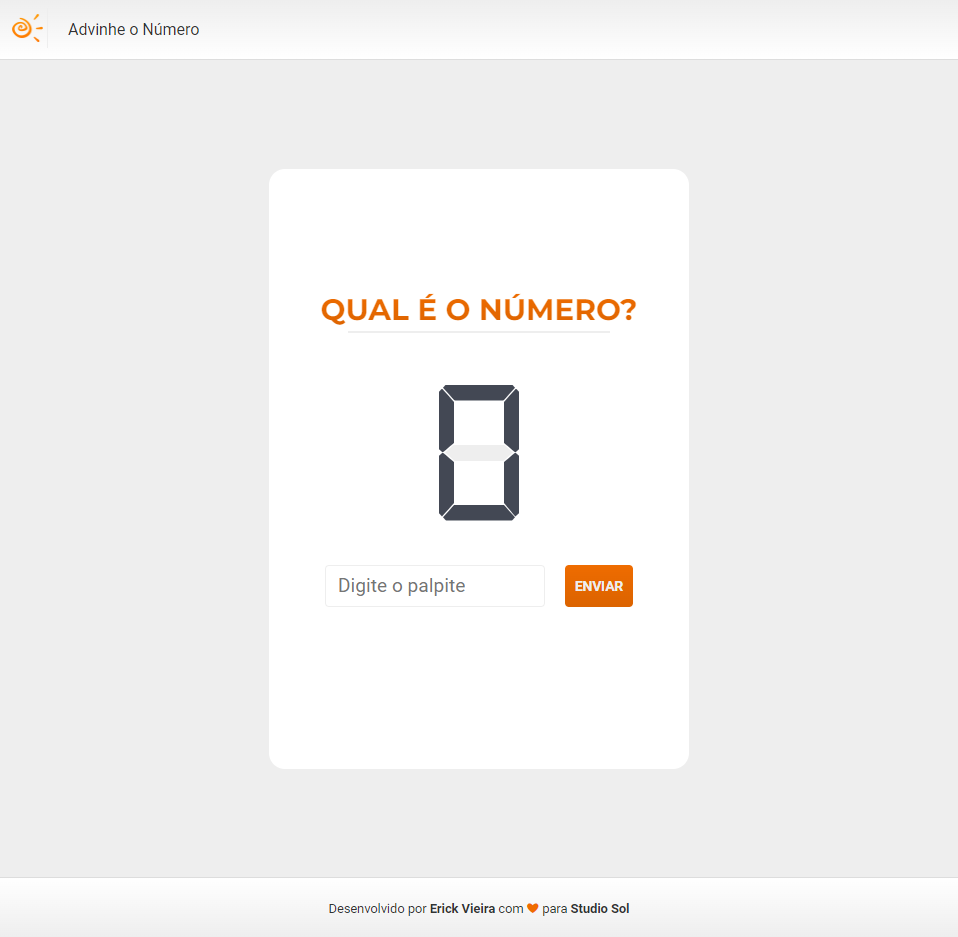

# Qual é o Número?

[English Version](./docs/English.md)

**Qual é o número?** é um jogo de Browser que tem como objetivo acertar um número sorteado aleatoriamente. O usuário pode configurar o intervalo do sorteio ou apenas começar uma partida sem uma pré configuração, e nesse caso, o valor estará entre 0 e 300. O valor máximo aceito pelo jogo é 999 e não são permitido valores negativos.

[Manual do Jogo](./docs/ComoJogar.md)



## Implementação

O projeto foi desenvolvido para testar habilidades em [HTML], [CSS] e [JavaScript]. Para agilizar o desenvolvimento foi utilizada a biblioteca [ReactJS] disponibilizada pelo **[Facebook]** (_[projeto aberto](https://github.com/facebook/react)_). A implementação foi melhorada utilizando o superset [Typescript] que trás melhorias à linguagem [Javascript]. Algumas bibliotecas de terceiros foram implementadas para auxílio em conexão com APIs, componentes estilizados e mensagens de erro amigáveis ao usuário.

## Como executar

### Primeiros passos

Para executar a aplicação basta clonar esse repositório localmente, e, ao acessar o diretório clonado bastar instalar os pacotes do node_modules e executar o script para iniciar o modo de desenvolvimento, pelo qual é possível testar a aplicação.

```powershell
  git clone https://github.com/vieiraerick/GuessNumber.git

  cd GuessNumber

  npm install

  npm run start
```

ou então:

```powershell
  git clone https://github.com/vieiraerick/GuessNumber.git

  cd GuessNumber

  yarn install

  yarn start
```

Ou então é possível executar um arquivo em lotes que está presente na raiz do diretório que executa os dois ultimos passos.

```powershell
  git clone https://github.com/vieiraerick/GuessNumber.git

  cd GuessNumber

  ./start.bat
```

### Editando o código

O código pode ser editado com qualquer editor de texto ou IDE de sua preferência.

### Testes automatizados

O projeto tambem foi utilizado como base para estudo de testes automatizados, sendo assim os testes presentes nessa versão são muito básicos pois são o começo dos estudos. Para executar os testes basta rodar o seguinte comando:

```powershell
yarn test
```

ou então

```powershell
npm run test
```

Também é possível executar testes e gerar um relatório de cobertura executando o seguinte comando:

```powershell
yarn testCoverage
```

ou então

```powershell
npm run testCoverage
```

### Scripts do projeto

### `yarn start`

Executa a aplicação em modo de desenvolvimento. Abra [http://localhost:3000](http://localhost:3000), para ver o projeto se a aplicação não abrir automaticamente.

### `yarn test`

Executa os testes automatizados.

### `yarn testCoverage`

Executa os testes e gera o [Relatório de Cobertura](./coverage/lcov-report/index.html).

### `yarn build`

Constrói a versão de produção do projeto.

## Tecnologias, Bibliotecas e Pacotes

- [HTML]
- [CSS]
- [Javascript]
- [Typescript]
- [ReactJS]
- [Axios](https://axios-http.com/docs/intro)
- [React Testing Library](https://testing-library.com/docs/react-testing-library/intro/)
- [Jest](https://jestjs.io/pt-BR/)
- [React Router](https://v5.reactrouter.com/web/guides/quick-start)
- [React Toastify](https://fkhadra.github.io/react-toastify/introduction)
- [Font Awesome](https://fontawesome.com/v5.15/how-to-use/on-the-web/using-with/react)
- [Styled Components](https://styled-components.com/)
- [Polished](https://polished.js.org/)
- [ESLint](https://eslint.org/)
- [Prettier](https://prettier.io/)

[facebook]: https://www.facebook.com/
[reactjs]: https://pt-br.reactjs.org/
[typescript]: https://www.typescriptlang.org/
[javascript]: https://www.javascript.com/
[html]: https://www.w3schools.com/html/
[css]: https://www.w3schools.com/css/
