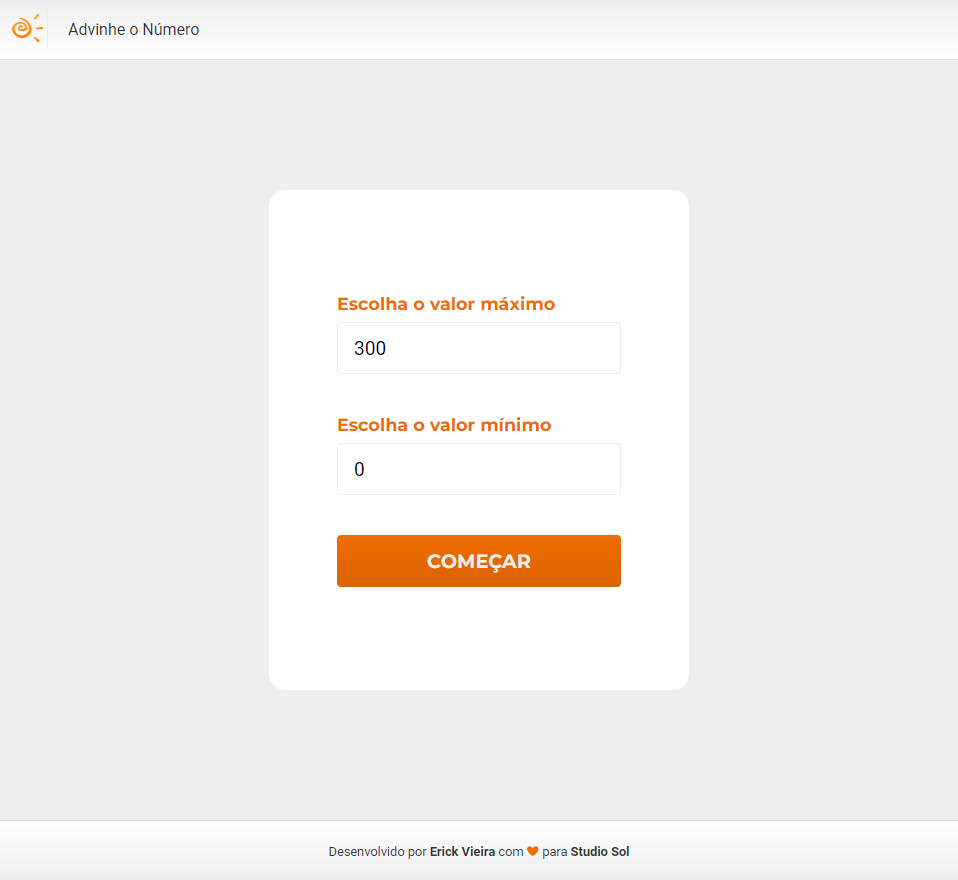
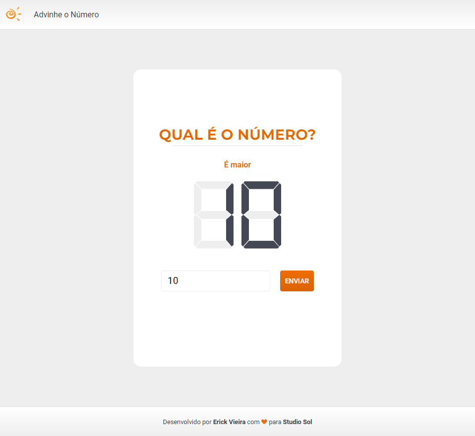
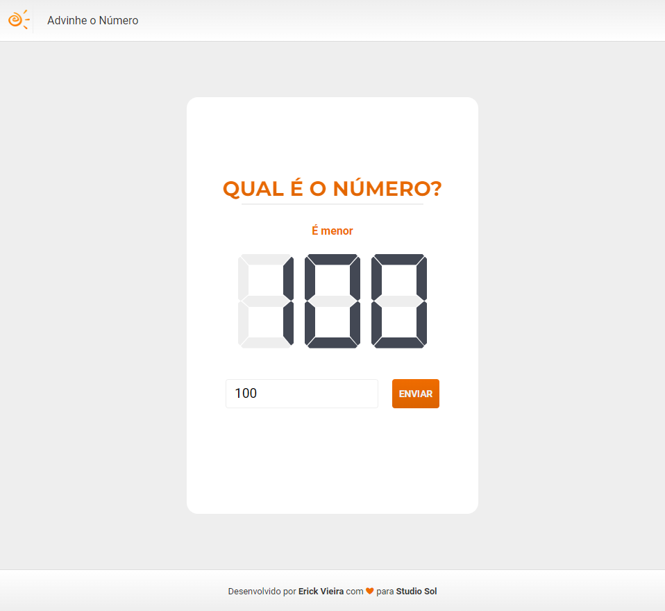

[Voltar](../README.md)

[English Version](./HowToPlay.md)

# Manual do Jogo

## Tela Inicial

Na tela inicial do jogo basta decidir se você deseja iniciar uma partida imediatamente ou se você deseja parametrizar o jogo antes de iniciar a partida.

## Configurações

Na tela de configurações, é possivel parametrizar qual será o intervalo do sorteio dos números, porémm não poderão ser utilizados valores menores que 0, maiores que 999 e o valor máximo nunca poderá ser menor que o valor mínimo.

## O Jogo

Para jogar basta incluir o seu palpite no campo indicado com _Digite o palpite_ e apertar o botão _Enviar_.

### Palpites Errados

Caso você envie um número menor que o sorteado o jogo informará que o número sorteado é maior:

Mas caso você envie um número maior que o sorteado o jogo informará que o número sorteado é menor:

### Vitória

Quando voce acertar o número, o jogo declarará a sua vitória e disponibilizará um botão para iniciar um novo jogo.

### Erros

A API pode falhar as vezes, para esse caso o jogo informará que ocorreu um erro e disponibilizará o código do erro e um botão para iniciar uma nova partida.

## A Página Secreta

Para testar se está tudo certo, existe uma página que mostra o número sorteado pela API e assim é possível conferir o funcionamento do jogo. Basta acessar:

[Página Secreta](http://localhost:3000/play/cheat)

## Voltando ao Início

Para retornar página inicial basta clicar no ícone do sol, no canto superior esquerdo.
