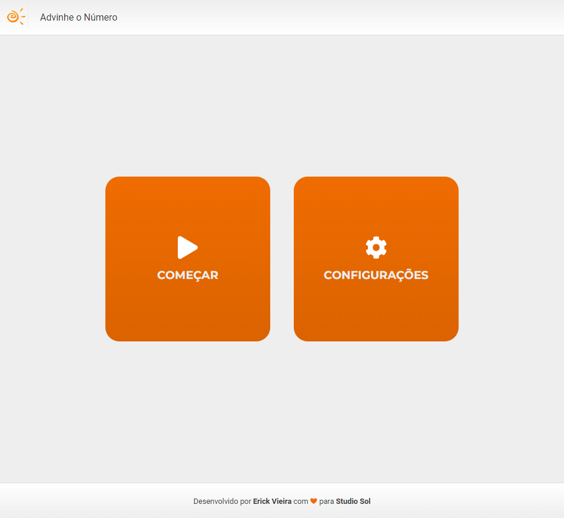
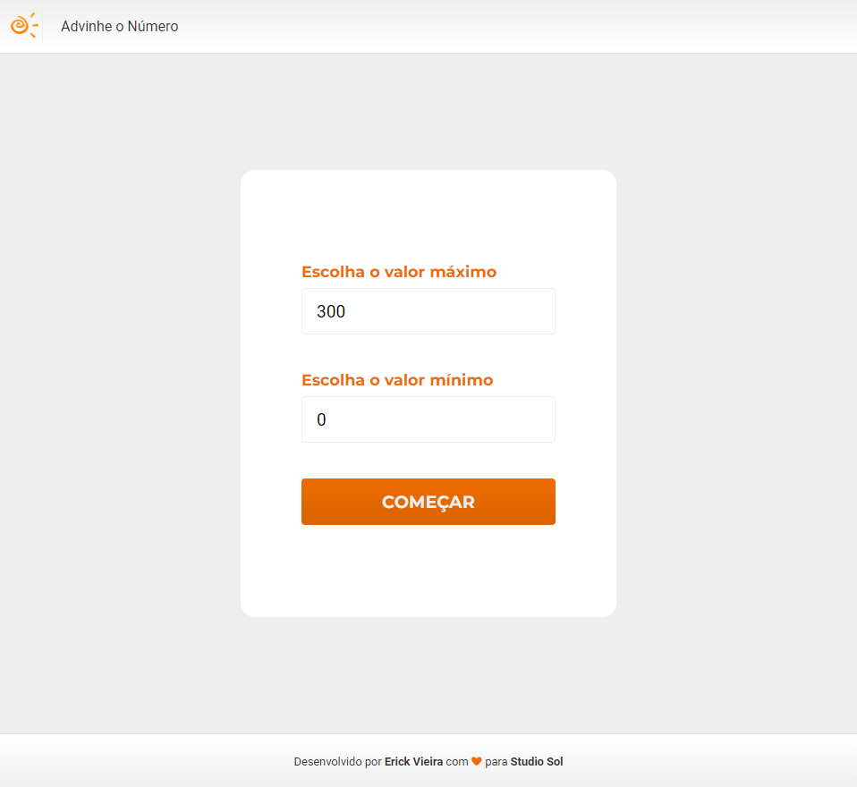
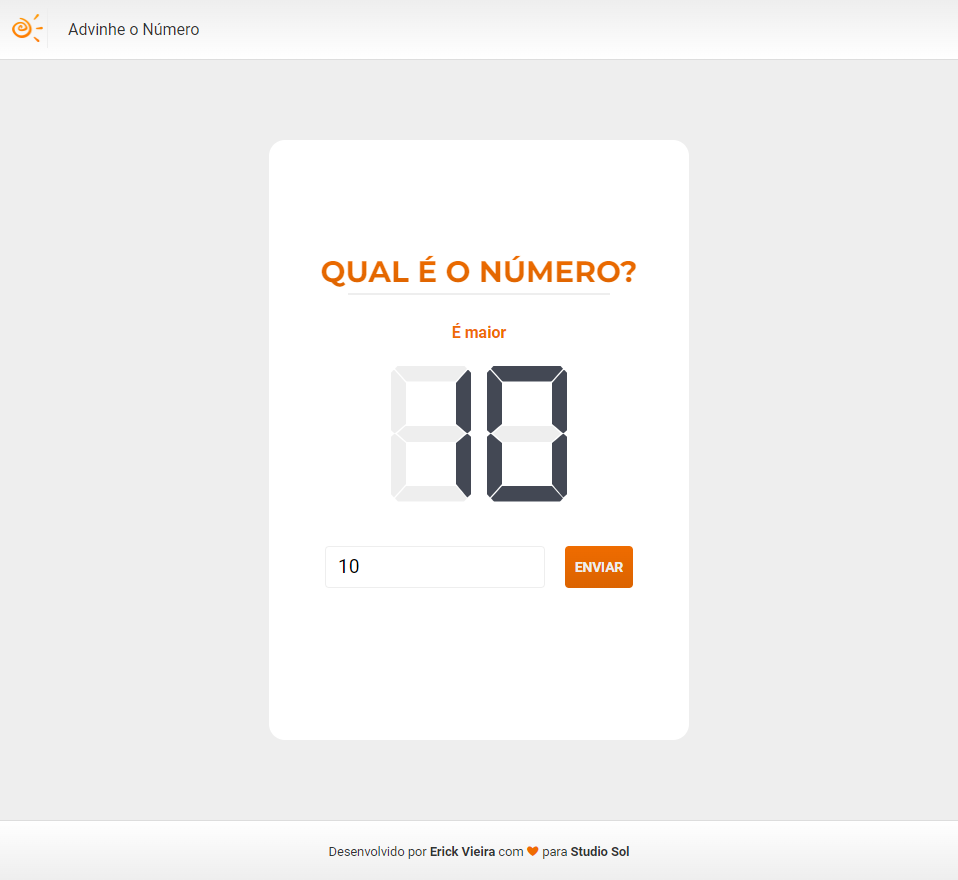
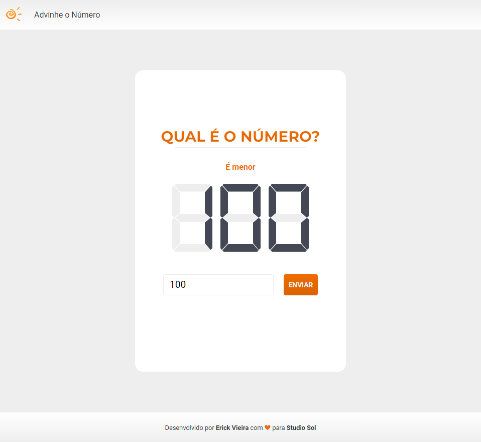
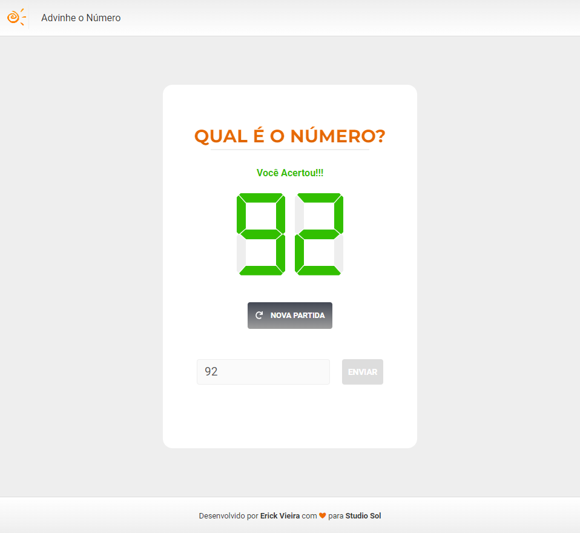
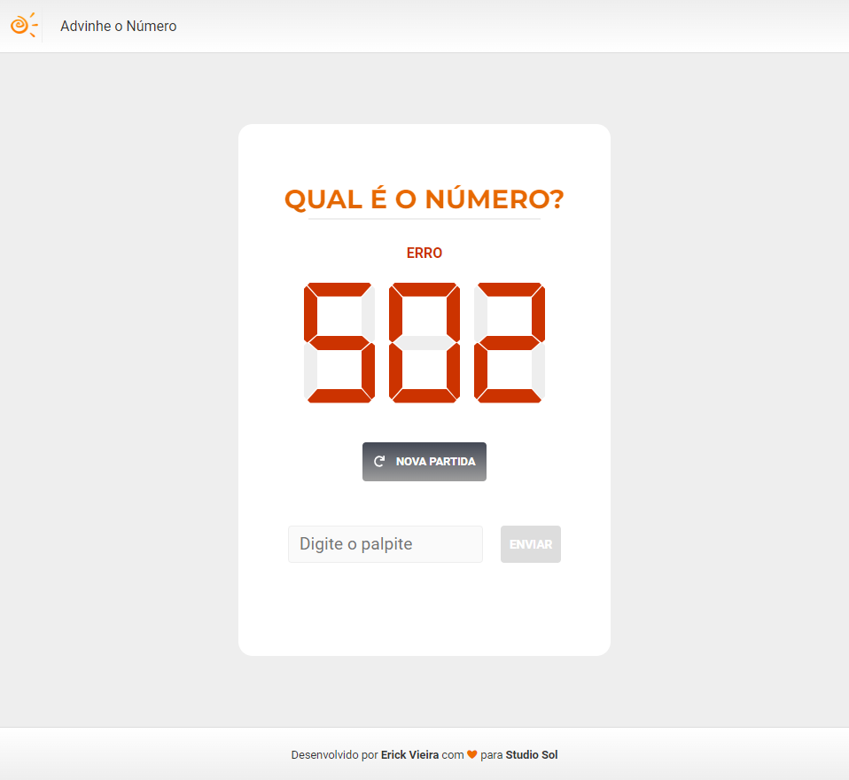

[Go Back](./English.md)

[Versão em Português](./ComoJogar.md)

# Game Manual

## Home

On the game's home screen, just decide if you want to start a game immediately or if you want to configure the game before starting the game.

## Settings

In the settings screen, it is possible to parameterize the interval for drawing the numbers, but values less than 0, greater than 999 cannot be used. And the maximum value can never be less than the minimum value.

## The Game

To play, just enter your guess in the field indicated with _Digite o Palpite_ and press the _ENVIAR_ button.

### Wrong Guesses

If you send a number smaller than the one drawn, the game will inform you that the number drawn is greater:

But if you send a number greater than the one drawn, the game will inform you that the number drawn is smaller:

### Victory

When you hit the number, the game will declare your victory and provide a button to start a new game.

### Errors

The API can sometimes fail, in which case the game will inform you that an error has occurred and will provide the error code and a button to start a new game.

## The Secret Page

To test if everything is ok, there is a page that shows the number drawn by the API and so it is possible to check how the game works. Just access:

[Secret Page](http://localhost:3000/play/cheat)

## Going Back

To return to the home page, just click on the sun icon in the upper left corner.
